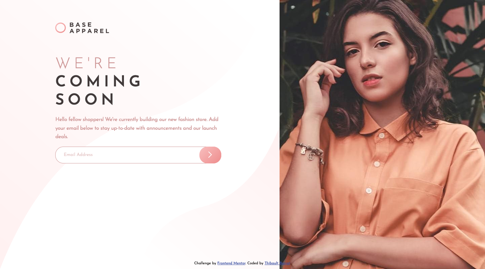

# Frontend Mentor - Base Apparel coming soon page solution

This is a solution to the [Base Apparel coming soon page challenge on Frontend Mentor](https://www.frontendmentor.io/challenges/base-apparel-coming-soon-page-5d46b47f8db8a7063f9331a0). Frontend Mentor challenges help you improve your coding skills by building realistic projects. 

## Table of contents

- [Overview](#overview)
  - [The challenge](#the-challenge)
  - [Screenshot](#screenshot)
  - [Links](#links)
- [My process](#my-process)
  - [Built with](#built-with)
  - [What I learned](#what-i-learned)
  - [Continued development](#continued-development)
  - [Useful resources](#useful-resources)
- [Author](#author)

## Overview

### The challenge

Users should be able to:

- View the optimal layout for the site depending on their device's screen size
- See hover states for all interactive elements on the page
- Receive an error message when the `form` is submitted if:
  - The `input` field is empty
  - The email address is not formatted correctly

### Screenshot



### Links

- Solution URL: [https://www.frontendmentor.io/solutions/coming-soon-page-with-css-grids-SX195t9y6](https://www.frontendmentor.io/solutions/coming-soon-page-with-css-grids-SX195t9y6)
- Live Site URL: [https://base-apparel-coming-soon-dusky-three.vercel.app/](https://base-apparel-coming-soon-dusky-three.vercel.app/)

## My process

### Built with

- Semantic HTML5 markup
- CSS grids
- SASS preprocessor
- BEM methodology
- Mobile first approach

### What I learned

I used CSS grids for this projects which I am not familir with :


```css
body {
    display: grid;
    grid-template-columns: auto 43%;
    grid-template-rows: min-content min-content 1fr;
}
```

I also used for the first time media queries in JavaScript in order to change image src depending on screen size. This is useful to not systematically load both images (desktop and mobile).

```js
//Change image src on breakpoint
function changeImageSrc(matchMedia) {
    if (matchMedia.matches) { // If media query matches
        document.querySelector('.hero-image').src = '../images/hero-desktop.jpg';
      } else {
        document.querySelector('.hero-image').src = '../images/hero-mobile.jpg';
      }
}

var matchMedia = window.matchMedia("(min-width: 768px)");
changeImageSrc(matchMedia); // Call listener function at run time
matchMedia.addListener(changeImageSrc); // Attach listener function on state changes 
```

### Continued development

Usage of CSS grids with this simple layout was not difficult but I probably have to try more difficult layouts in order to discover all possibilities of CSS grids.

### Useful resources

- [How TO - Media Queries with JavaScript](https://www.w3schools.com/howto/howto_js_media_queries.asp) - A simple example of how to use media queris in JavaScript.
- [A Complete Guide to Grid](https://css-tricks.com/snippets/css/complete-guide-grid/) - All you need to know about CSS grids is here.


## Author

- Website - [Thibault Barrat](https://www.thibault-barrat.com/)
- Frontend Mentor - [@thibault-barrat](https://www.frontendmentor.io/profile/thibault-barrat)
- Twitter - [@Thib_Bar](https://www.twitter.com/Thib_Bar)

